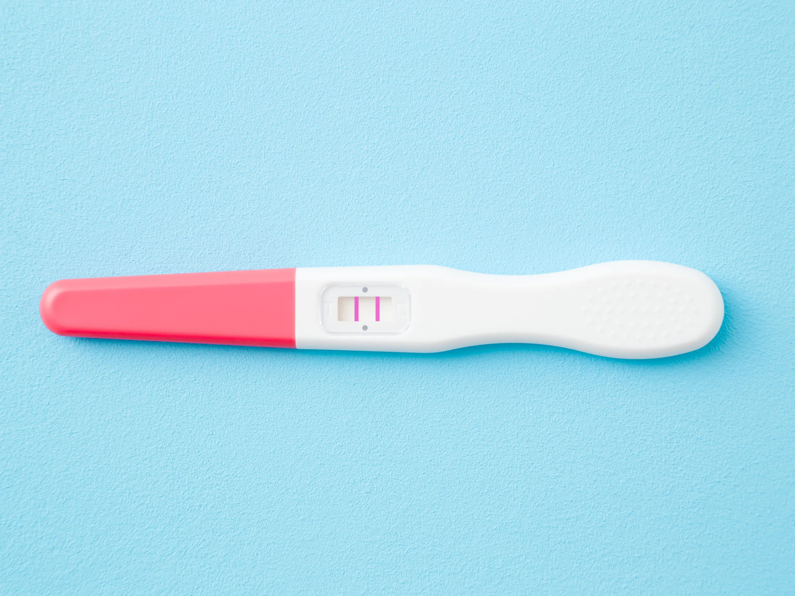

# Gender Prediction Without Machine Learning

<p align="center">
  
</p>

In this mini python project we used two popular library to create a **completely fake dataset** with [Faker](https://github.com/joke2k/faker) and extract **some features** with [names-dataset](https://github.com/philipperemy/name-dataset).

First, install these libraries:
```
pip install Faker
pip install names-dataset
```
Now, you can run [notebook](https://github.com/iamem1r/gender_detection/blob/main/Gender_Detection.ipynb) without problem, then you're able to create your own dataset and work with it.

***Hope you Enjoy!***